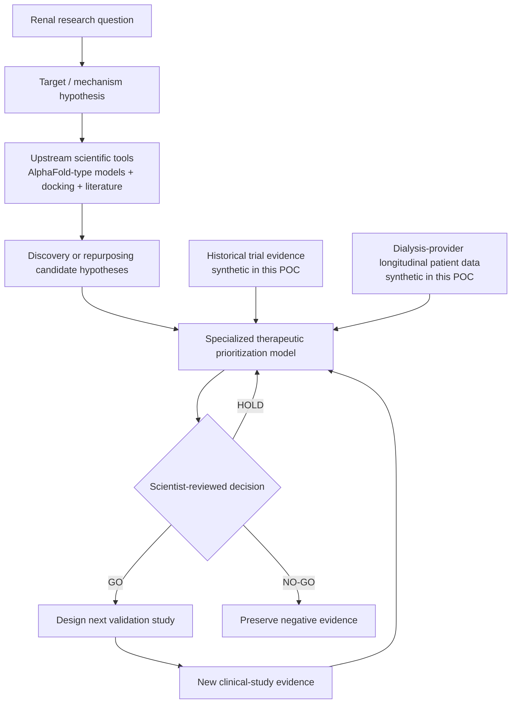

# RTRO — Renal Therapeutics Research Orchestrator

A synthetic dry-lab POC for an AI-orchestrated renal therapeutics research pipeline. It connects upstream discovery and drug-repurposing hypotheses with downstream clinical evidence and iterative research decisions.

RTRO demonstrates the closed-loop AI science pattern:

> use computation to prioritize a research hypothesis, use experimental evidence to test it, then use the evidence to make the next decision better.

It demonstrates the orchestration and decision layer behind an AI-scientist platform. It does **not** claim biological validation, treatment recommendation, or clinical efficacy.



## Why this matters

Renal research is a sequence of expensive, uncertain decisions. The value of AI is not to eliminate wet labs or clinical studies. It is to reduce uncertainty before each investment, connect fragmented evidence, and make the next experiment more purposeful.

## What this POC contains

| Layer | In this POC | Real-world equivalent |
|---|---|---|
| Research context | Fictional renal therapeutic hypothesis and target | Renal research question, literature, internal program context |
| Upstream reasoning | Transparent discovery / repurposing candidate ranking | Structure/interaction models, docking, chemistry models, literature and data analysis |
| Evidence | Synthetic trial-like and dialysis-provider cohort signals | Historical trial evidence, biomarkers, and governed longitudinal patient data |
| Decision | Traceable `GO` / `HOLD` / `NO-GO` | Scientist-reviewed experiment and program decisions |
| Learning loop | Revised score and next action | New hypotheses, experiment designs, specialized model improvement, organizational knowledge |

## Scientific boundary

All targets, molecules, lab results, cohort signals, and decisions are synthetic. This repository is educational software—not medical software.

- It does not run AlphaFold, docking, molecular dynamics, wet-lab experiments, animal studies, or clinical trials.
- Wet-lab and animal studies are deliberately abstracted out of this POC; the synthetic clinical-evidence layer represents the downstream evidence and feedback loop.
- AlphaFold-type models belong in the upstream structural-hypothesis layer; they do not prove efficacy or replace validation.
- Wet-lab and clinical evidence normally improves scientific decisions, disease/response models, and future experiment selection—not automatically AlphaFold itself.
- Every meaningful real-world decision requires scientist review, data governance, and regulated validation.
- Real DaVita or other patient data is **not** included and must never be placed in this public repository.

## Explore the project

- [End-to-end pipeline, orchestration, and technology map](docs/PIPELINE.md)
- [Synthetic data model and feedback loop](data/README.md)

## Run locally

```bash
python3 src/closed_loop.py
```

The script generates a local, ignored decision report in `outputs/`.
