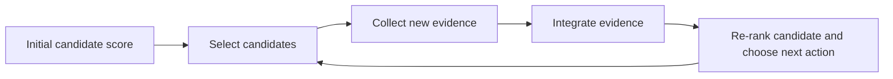

# Synthetic Data

`research-program.json` is a fictional ESKD drug-repurposing research program: one target, five fictional existing-drug candidates, and downstream evidence for the two candidates selected for simulated testing.

## Evidence schema

| Field | Meaning in the POC | Real-world analogue |
|---|---|---|
| `computational_fit` | Initial in-silico candidate signal | Structure, docking, chemistry, or model output |
| `developability` | Initial practical feasibility signal | ADMET, formulation, synthesis, or program constraints |
| `assay_effect` | Simulated biological response | Cell, organoid, or biochemical assay result |
| `preclinical_signal` | Simulated in-vivo / preclinical evidence | Animal or other preclinical study output |
| `safety_signal` | Simulated safety evidence | Toxicology or safety data |
| `cohort_response` | Simulated renal-cohort response | Trial, patient, or biomarker data analysis |
| `subgroup_consistency` | Simulated consistency across a renal subgroup | Patient stratification / biomarker subgroup result |

## Feedback loop

The synthetic values make this loop observable and reproducible. In a real deployment, each evidence item would also need provenance, data-quality checks, access controls, and scientist interpretation.

## What “model improvement” means

Downstream evidence may validate or reject hypotheses, calibrate a decision score, improve a specialized assay/safety/response model, or guide the next experiment. It does **not** mean every new lab or clinical record is used to fine-tune every upstream model. In particular, clinical data is generally not direct training data for a protein-structure model such as AlphaFold. The public POC contains synthetic data only; no patient data is included.
