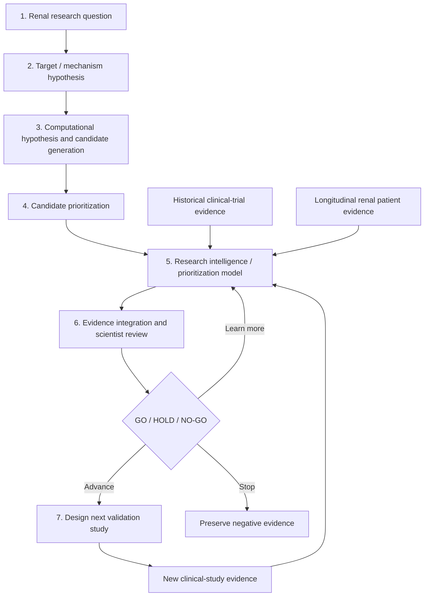
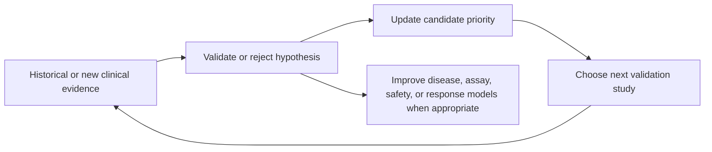

# RIEL Research Pipeline

## The real pipeline

The real pipeline can include wet-lab and animal/preclinical studies between candidate prioritization and clinical work. RIEL deliberately abstracts those stages to keep the POC focused on the clinical-evidence feedback loop. The POC compresses the remaining pipeline into minutes by using synthetic data only.

## Technology map

| Stage | Question | Typical AI / data capability | POC representation |
|---|---|---|---|
| 1–2 | What renal mechanism or unmet need is worth investigating? | Literature, omics, experimental and clinical evidence synthesis | Fictional ESKD research question and target hypothesis |
| 3 | Which existing drug might plausibly affect the target or mechanism? | Protein structure/interaction models such as AlphaFold-type models; generative chemistry | Fixed fictional repurposing-candidate pool |
| 4 | Which candidate should receive scarce resources first? | Docking, virtual screening, chemistry/developability models, prior evidence | Transparent initial score |
| 5 | How should candidate, patient, and historical trial evidence be combined? | Proprietary prioritization model, statistical models, rules, agent orchestration, provenance | Deterministic evidence-integration model |
| 6 | Is there evidence across renal patient subgroups or biomarkers? | Governed clinical/biomarker data analysis, patient stratification | Synthetic trial-like and renal-cohort response signals |
| 7 | What should happen next? | Evaluation, human review, prospective-study design | Traceable score and `GO` / `HOLD` / `NO-GO` |

## Where AlphaFold fits

AlphaFold-type models are an important **upstream** capability. They predict protein structure and, in newer interaction-oriented approaches, support hypotheses about protein–molecule or protein–protein interactions. In RIEL, they would help prioritize an existing-drug repurposing hypothesis when a credible molecular target exists. They do not independently choose a drug, prove an effect in a living system, or replace clinical validation.

## What the loop learns

The feedback is not automatically “fine-tune AlphaFold with clinical data.” AlphaFold-type tools supply upstream structure information. The loop feeds the **research intelligence / prioritization model**: a potential proprietary system combining evidence-integration logic, statistical models, evaluation, and scientist-defined rules. Different data types can improve different components; the common outcome is better scientific prioritization and a more defensible next decision.
