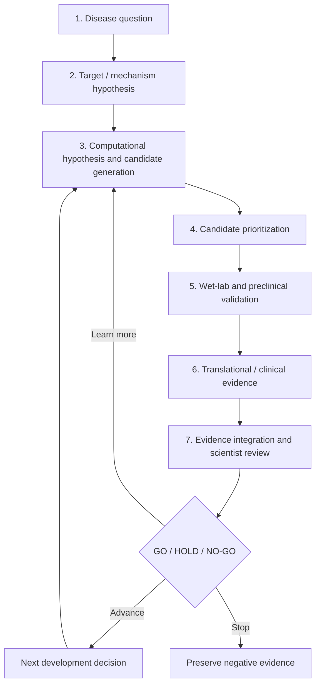
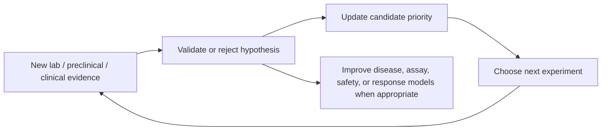

# End-to-End Research Pipeline

## The real pipeline

This is a long research and development pipeline in reality. The POC compresses it into minutes by using synthetic data only.

## Technology map

| Stage | Question | Typical AI / data capability | POC representation |
|---|---|---|---|
| 1–2 | What disease mechanism is worth investigating? | Literature, omics, experimental and clinical evidence synthesis | Fictional research question and target hypothesis |
| 3 | What might bind, modify, or affect the target? | Protein structure/interaction models such as AlphaFold-type models; generative chemistry | Fixed fictional candidate pool |
| 4 | Which candidate should receive scarce resources first? | Docking, virtual screening, chemistry/developability models, prior evidence | Transparent weighted score |
| 5 | Does the hypothesis hold in biological systems? | ELN/LIMS integration, assay/image/omics analysis, CRO outputs | Synthetic assay, preclinical, and safety signals |
| 6 | Is there evidence across patients or biomarkers? | Governed clinical/biomarker data analysis, patient stratification | Synthetic cohort response and subgroup consistency |
| 7 | What should happen next? | Agent orchestration, evidence provenance, evaluation, human review | Traceable score and `GO` / `HOLD` / `NO-GO` |

## Where AlphaFold fits

AlphaFold-type models are an important **upstream** capability. They predict protein structure and, in newer interaction-oriented approaches, support hypotheses about protein–molecule or protein–protein interactions. They help shrink the search space; they do not independently choose a drug, prove an effect in a living system, or replace clinical validation.

## What the loop learns

The feedback is not automatically “fine-tune AlphaFold with clinical data.” Different data types serve different models. The common outcome is better scientific prioritization and a more defensible next decision.
