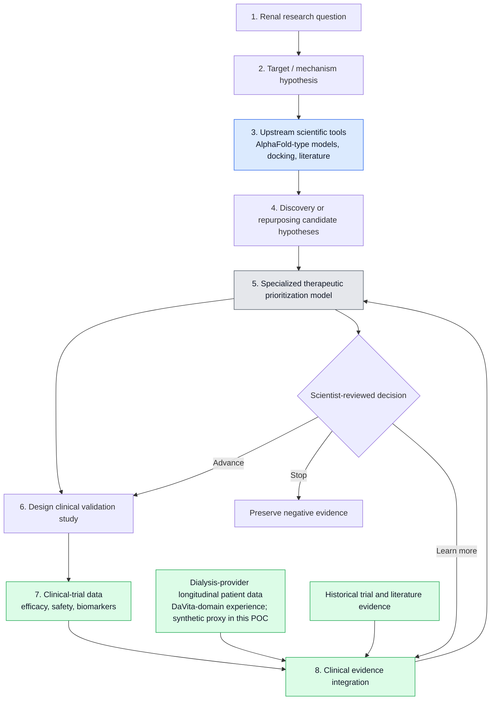
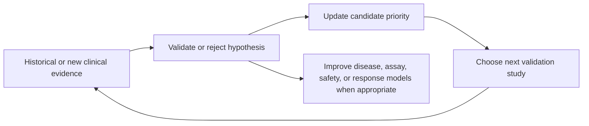

# RTRO Research Pipeline

## The real pipeline

The real pipeline can include wet-lab and animal/preclinical studies between candidate prioritization and clinical work. RTRO deliberately abstracts those stages to keep the POC focused on the orchestration and clinical-evidence feedback loop. The POC compresses the remaining pipeline into minutes by using synthetic data only.

## Data assets: two distinct sources

- **Clinical-trial data** comes from a defined study protocol and includes controlled efficacy, safety, and biomarker evidence.
- **Dialysis-provider longitudinal data** comes from care delivery: repeated patient records, treatments, laboratory values, and outcomes over time. It is real-world evidence, not automatically clinical-trial data.

Both sources can improve research prioritization, but they require different governance, quality checks, and causal interpretation. RTRO uses synthetic representations only. The DaVita reference describes relevant renal-domain experience, not a public claim of access to or use of DaVita data.

## Technology map

| Stage | Question | Typical AI / data capability | POC representation |
|---|---|---|---|
| 1–2 | What renal mechanism or unmet need is worth investigating? | Literature, omics, experimental and clinical evidence synthesis | Fictional ESKD research question and target hypothesis |
| 3 | Which new or existing drug might plausibly affect the target or mechanism? | Protein structure/interaction models such as AlphaFold-type models; generative chemistry | Fixed fictional candidate pool |
| 4 | Which hypothesis should receive scarce resources first? | Docking, virtual screening, chemistry/developability models, prior evidence | Transparent initial score |
| 5 | How should candidate and existing evidence be prioritized? | Specialized/proprietary prioritization model, statistical models, rules, agent orchestration, provenance | Deterministic initial score |
| 6–8 | What did the study and care-delivery data show? | Trial-data analysis, governed real-world evidence analysis, patient stratification | Synthetic clinical-trial-like and dialysis-provider cohort signals |
| Decision | What should happen next? | Evaluation, human review, prospective-study design | Traceable score and `GO` / `HOLD` / `NO-GO` |

## Where AlphaFold fits

AlphaFold-type models are an important **upstream** capability. They predict protein structure and, in newer interaction-oriented approaches, support hypotheses about protein–molecule or protein–protein interactions. In RTRO, they provide one source of evidence before the specialized therapeutic prioritization model; they can support new-discovery or existing-drug repurposing hypotheses when a credible molecular target exists. They do not independently choose a drug, prove an effect in a living system, or replace clinical validation.

## What the loop learns

The feedback is not automatically “fine-tune AlphaFold with clinical data.” AlphaFold-type tools supply upstream structure information. The loop feeds the **specialized therapeutic prioritization model**: a potential proprietary system combining evidence-integration logic, statistical models, evaluation, and scientist-defined rules. Different data types can improve different components; the common outcome is better scientific prioritization and a more defensible next decision.
