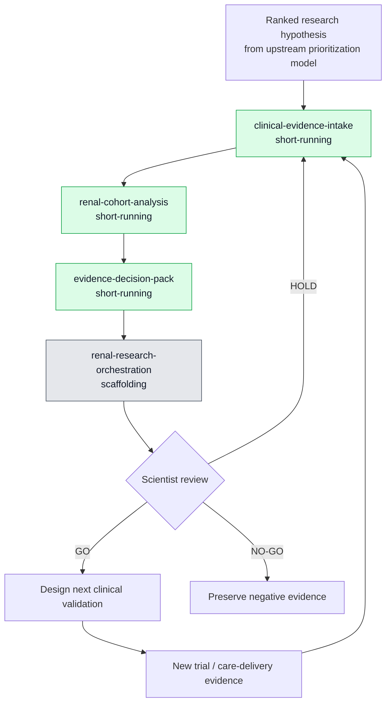

# Phase 2 — Skills-Based Clinical Evidence Workflow

This workflow begins **after** the upstream scientific system has emitted a ranked drug–target–patient-subgroup hypothesis. AlphaFold-type tools and the proprietary therapeutic prioritization model remain upstream context; they are not implemented by these skills.

## Skill roles

| Skill | Run type | Purpose | Does not do |
|---|---|---|---|
| `clinical-evidence-intake` | Short-running | Normalize source metadata, data grain, provenance, and allowed-use status | Access real patient data or perform treatment decisions |
| `renal-cohort-analysis` | Short-running | Define a cohort-analysis plan, outcomes, subgroups, and confounding checks | Claim causality or clinical efficacy |
| `evidence-decision-pack` | Short-running | Produce a traceable evidence pack for scientist review | Issue an autonomous GO / HOLD / NO-GO decision |
| `renal-research-orchestration` | Scaffolding | Define state, sequence, handoffs, and re-entry conditions for the long loop | Build or retrain the proprietary prioritization model |

## Data boundary

Clinical-trial data and dialysis-provider longitudinal patient data are distinct sources. This public prototype contains only synthetic representations. The skills require provenance, permitted-use status, and human review before any result can enter a research decision.

## Why this is an FDE-relevant prototype

The specialized model may be a black box owned by a research platform. The delivery problem remains: connect heterogeneous evidence, give scientists a reliable review artifact, preserve governance and traceability, and make the next iteration easier to execute. This skills scaffold prototypes that delivery layer.
